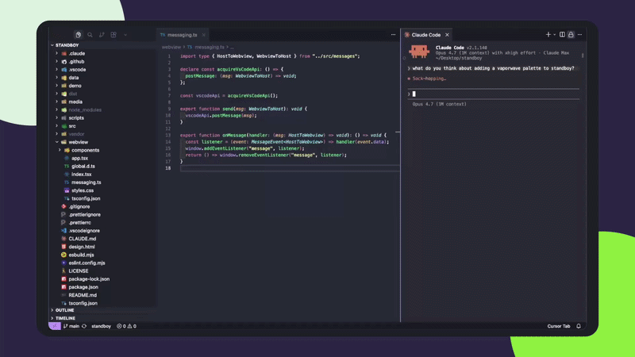

<p align="center">
  
</p>

<h1 align="center">Standboy</h1>

<p align="center">A Game Boy that wakes up while your agent works.</p>

<p align="center">
  <a href="https://marketplace.visualstudio.com/items?itemName=mfbzme.standboy"></a>
  <a href="https://open-vsx.org/extension/mfbzme/standboy"></a>
  <a href="LICENSE"></a>
</p>

<p align="center">
  
</p>

When your AI coding agent starts generating, Standboy auto-expands a sidebar Game Boy emulator. When the agent finishes, Standboy tucks back down and the emulator pauses. He resumes mid-frame the next time your agent wakes him up.

The hidden cost of agent wait time isn't boredom — it's the tab-switch to Twitter, Reddit, or Slack, where ten minutes evaporate before you remember the agent finished. A built-in micro-distraction with a hard pause boundary keeps you in the IDE.

## Features

- **Auto-show on agent activity, auto-hide when idle.** Hooks into Cursor's native agent and Claude Code via their official lifecycle APIs (one toggle in the panel's menu wires it up). Falls back to an edit-burst heuristic for agents we don't have specific support for. The panel pops up only when the agent has actually been working for a few seconds, and tucks back after a similar idle window — never strobes on quick "let me check" turns.
- **Resumes mid-frame.** The webview is retained when hidden — Standboy pauses in place and picks up exactly where he left off.
- **Persistent ROM library and saves.** Loaded ROMs are copied into a managed library; in-game saves mirror to disk on panel hide, page unload, and before Export — between writes the live state lives in IndexedDB so you never lose progress. Both survive VSCode restarts.
- **Auto-identified covers and titles.** ROM dumps are matched by SHA-1 against a bundled No-Intro database — the same approach RetroArch uses — so the library grid shows real box art and the canonical title regardless of what the file is named on disk.
- **Game Boy, Game Boy Color, and Game Boy Advance.** Loads `.gb`, `.gbc`, and `.gba` ROMs. Platform auto-detected from the file extension.
- **User-supplied ROMs only.** No bundled games, no links to ROM sources. You bring your own legally-obtained file from disk.
- **Five built-in palettes**, plus a custom 4-hex array. Palette changes apply only to the chrome — the game itself renders at native fidelity.
- **Keyboard controls, fully rebindable.** Arrow keys drive the D-pad; A, B, Start, and Select can be bound to any key from the in-panel menu.
- **No telemetry.** The only outbound network calls are one-shot cover-art fetches against [libretro-thumbnails](https://thumbnails.libretro.com) — performed by the extension host (not the iframe), cached locally, never repeated for the same ROM. The emulator ([EmulatorJS](https://emulatorjs.org)) and the No-Intro database are bundled and run offline.

## Install

**VS Code** — open the Extensions panel and search for **Standboy**, or:

```bash
code --install-extension mfbzme.standboy
```

**Cursor and other VS Code forks** — install from the Extensions panel. Cursor uses Open VSX as its registry by default.

**From a `.vsix`** (pre-release builds):

```bash
code --install-extension standboy-x.y.z.vsix
```

## First launch

The first time Standboy activates, it auto-opens the panel — no modal. You'll see:

- An empty header (`STANDBOY` activity dot, ROM title slot, `⋯` menu, mute icon)
- A blank screen frame with the words **`no cartridge`**
- A small **Auto-show during AI activity** card above the library grid, prompting you to connect whichever agent is detected (Claude Code if `~/.claude/settings.json` exists, or Cursor if you're running inside Cursor). Click **Connect** to wire up the lifecycle hooks, or the **×** to dismiss it — you can always toggle the same thing later from the `⋯` menu under **Detection**.
- An empty library grid showing only a dashed **+ Add ROM** tile

After your first successful connect, a one-shot footnote reminds you to disconnect Detection before uninstalling Standboy (VSCode has no reliable uninstall hook). The footnote auto-dismisses after a few seconds, and there's an **×** to close it sooner.

From here:

1. Click the **+ Add ROM** tile (or **Load ROM…** from the menu drawer).
2. Pick a `.gb`, `.gbc`, or `.gba` file from disk. Standboy copies it into your library, identifies it against the bundled No-Intro database, and starts playing.
3. Cover art appears in the library grid a few seconds later as the libretro lookup completes (or a letter-tile fallback for homebrew/hacks).
4. Next time you launch VSCode, Standboy auto-resumes the last ROM you played, with your save data restored.

## Usage

Click into the panel and the emulator takes keyboard input. Default bindings (right-hand on the arrows, left-hand on the action keys):

| Key        | Action |
| ---------- | ------ |
| Arrow keys | D-pad  |
| `Z`        | A      |
| `X`        | B      |
| `Enter`    | Start  |
| `Shift`    | Select |

Open the menu (`⋯` → drawer drops down from the top) and click any of the four action chips (`A`, `B`, `Start`, `Sel`) to rebind — Standboy listens for the next keystroke and assigns it. Bindings persist to `<libraryRoot>/config.json` and roam with your library.

### The menu

The `⋯` icon at the top-right opens a drawer that slides down from the top. Four sections inside:

- **Audio** — a single Sound row with an `On / Off` pill. Click anywhere on the row to toggle. Browser autoplay policies mean audio actually starts on the first click after the panel mounts; subsequent toggles are instant.
- **Controls** — keyboard reference for the D-pad (arrows) and a row of four chips for `B`, `A`, `Start`, `Sel`. Click a chip → it turns green and listens for your next keystroke → assigns and saves. Press Esc to cancel.
- **Detection** — one row per detected AI agent (Claude Code, Cursor) with an `On / Off` pill. Click to install or remove the lifecycle hooks for that agent. Connections are **mutually exclusive**: turning one agent On automatically turns the other Off, so the two can never race over the same activity sentinel. If neither agent is detected on this system, you'll see a short message instead — Standboy still works as a manual emulator, the auto-show feature just stays off.
- **Library** — Load ROM, Export save, Import save, Open library folder, Delete ROM, Show logs.

Click the `×` in the drawer's top-right (or anywhere outside it) to close. Esc also closes.

### Switching ROMs

Click any cover in the library grid to switch to that ROM. The currently-playing ROM is highlighted with a green ring; clicking a different cover while a game is running brings up a confirmation prompt (the new game starts only after you confirm — your in-progress save has already been flushed by then, so cancelling is non-destructive). On confirm, Standboy persists which ROM is active and reloads — the new game's save is loaded automatically.

The **+ Add ROM** tile at the end of the grid opens the file picker.

## Auto-show during AI activity

Standboy wires itself into your agent's lifecycle hooks from the **Detection** section in the menu drawer. Once connected, the panel auto-appears the moment the agent starts thinking and tucks back when it stops — using the editor's own first-class signal, not edit-pattern guessing.

Open the panel's `⋯` menu, scroll to **Detection**, and turn on the agent you want connected. Detection is **mutually exclusive** — exactly one agent has Standboy hooks installed at a time, so a stop event from one can't accidentally hide the panel while the other is still working.

- **Claude Code** (CLI or [VSCode extension](https://marketplace.visualstudio.com/items?itemName=anthropic.claude-code)) — appears in the Detection section if `~/.claude/settings.json` or `~/.claude/projects/` exists. Toggling **On** adds entries for `UserPromptSubmit` and `PreToolUse` (start) and `Stop` (stop) to `~/.claude/settings.json`, merging non-destructively with whatever you already have.
- **Cursor's native agent** — appears if you're running Standboy inside Cursor. Toggling **On** writes `beforeSubmitPrompt` (start), `afterAgentResponse` and `sessionEnd` (stop, with a safety-net) entries to `~/.cursor/hooks/hooks.json`, preserving existing hooks alongside ours.

Both hook configs invoke a tiny Node script Standboy installs at `~/.standboy/marker.cjs`. The script touches `~/.standboy/agent-active` while the agent runs and deletes it when the agent stops; Standboy watches that file and flips panel state to match. No polling, no heuristics — strictly the editor's own lifecycle.

Toggling is **idempotent** — flipping **On** again only adds anything that's missing; flipping **Off** strips only Standboy's entries from the config file, leaving everything else intact. If neither agent is detected on this system, the Detection section shows a short note and auto-show stays off; Standboy still runs fine as a manual emulator.

> **Before uninstalling Standboy, toggle Detection Off here.** That's the cleanup step. VSCode doesn't expose a reliable uninstall lifecycle ([microsoft/vscode#155561](https://github.com/microsoft/vscode/issues/155561), [#102260](https://github.com/microsoft/vscode/issues/102260)), so we don't try to clean up automatically — every comparable extension takes the same approach. If you forgot, see the [Troubleshooting](#troubleshooting) entry for manual cleanup.

For agents we don't have specific hook support for (Aider, Cline, GitHub Copilot Edits, etc.), an edit-burst heuristic still runs as a fallback — less precise, but the panel still pops up during obvious agent bursts.

### Show / hide timing

Both edges of the auto-show transition are debounced so trivial "let me check" agent turns don't strobe the panel:

- **5-second show delay.** The agent has to be working for at least 5 seconds before the panel actually focuses. Quick chat-only responses never open it.
- **5-second hide delay.** When the agent stops, Standboy waits 5 seconds before sending focus back. A back-to-back follow-up turn keeps the panel up uninterrupted; only a real lull triggers the auto-collapse.
- **Visible countdown.** When the hide timer is running, a thin progress bar in the palette's accent green shrinks across the top of the panel over those 5 seconds — so you can see the auto-collapse coming and aren't surprised by the focus shift.

If you'd rather Standboy never auto-show and stay strictly manual, open the panel's `⋯` menu and flip **Auto-show** off (equivalent to setting `standboy.autoShow` to `false`). The activity dot still pulses while an agent is working, so you can glance at the activity bar to see the agent's state — but focus never moves on its own.

## Data and storage

Standboy keeps your ROMs and saves in a managed library on disk. Everything is plain files — back up, sync, or move the folder however you like.

### Where things live

By default, the library sits under VSCode's `globalStorage` directory:

| OS      | Default library path                                                     |
| ------- | ------------------------------------------------------------------------ |
| macOS   | `~/Library/Application Support/Code/User/globalStorage/mfbzme.standboy/` |
| Linux   | `~/.config/Code/User/globalStorage/mfbzme.standboy/`                     |
| Windows | `%APPDATA%\Code\User\globalStorage\mfbzme.standboy\`                     |

Inside that folder:

```
library.json     ← index: hash → { name, canonicalName, ext, size, addedAt, lastPlayedAt }
config.json      ← user settings (key bindings; future global prefs)
roms/
  <hash>.gba     ← copy of every ROM you've loaded
  <hash>.gbc
  <hash>.gb
saves/
  <hash>.sav     ← in-game battery save (Pokémon-style save slot)
covers/
  <hash>.png     ← cached box art (fetched once from libretro-thumbnails)
  <hash>.miss    ← zero-byte marker: this ROM has no cover, don't refetch
```

`<hash>` is the first 16 hex chars of SHA-256 of the ROM bytes. Renaming or moving the original ROM doesn't lose anything — Standboy has its own copy and indexes by content, not filename. `canonicalName`, when present, is the No-Intro title resolved by SHA-1 lookup against the bundled database — that's what feeds the library grid's display name and cover lookup.

### What persists, what doesn't

| State                              | Across panel hide | Across VSCode restart | Across machine  |
| ---------------------------------- | ----------------- | --------------------- | --------------- |
| ROM library + in-game saves        | ✓                 | ✓                     | ✓ (copy folder) |
| Currently-loaded ROM (auto-resume) | ✓                 | ✓                     | ✓               |
| Mid-frame emulator state           | ✓                 | ✗                     | ✗               |

In-game saves are mirrored to disk on real lifecycle events — when the panel becomes hidden, when VSCode reloads or quits, and right before Export Save / Import Save (which force-flush so the file always reflects the latest state). Between those events the live SRAM lives in the browser's IndexedDB (auto-persisted by EmulatorJS), so you never lose progress even if no disk write has fired yet. Mid-frame emulator state (program counter, register file, in-flight audio buffers) lives only in the webview and is lost on restart — but in-game saves cover the cases that matter.

### Backing up

Copy the library folder. That's all of it: ROMs, saves, the index. Restore by copying it back.

```bash
# macOS example: back up the whole library to iCloud Drive
cp -r ~/Library/Application\ Support/Code/User/globalStorage/mfbzme.standboy/ \
      ~/Library/Mobile\ Documents/com~apple~CloudDocs/Standboy/
```

Or change `standboy.libraryDirectory` (see [Configuration](#configuration) below) to point at a synced folder directly.

### Managing the library

Every action lives in the panel's menu drawer (`⋯` at the top-right):

| Menu item               | What it does                                                                                                 |
| ----------------------- | ------------------------------------------------------------------------------------------------------------ |
| **Load ROM…**           | Pick a ROM from disk; copy into the library; start playing                                                   |
| **Export save**         | Save the current ROM's `.sav` to a location of your choosing                                                 |
| **Import save**         | Load a `.sav` file into the current ROM (the game reloads with it)                                           |
| **Open library folder** | Reveal the library folder in Finder/Explorer/Files                                                           |
| **Delete ROM…**         | Quick-pick → confirm → remove ROM file, save file, cover, and index entry                                    |
| **Show logs**           | Reveal the Standboy output channel (where the extension's logs go) — first stop when something behaves oddly |

Switching ROMs is one click in the library grid. Connecting/disconnecting AI agents lives in the **Detection** section of the same menu (see [Auto-show](#auto-show-during-ai-activity)).

## Configuration

| Setting                     | Type       | Default    | Description                                                                                                                       |
| --------------------------- | ---------- | ---------- | --------------------------------------------------------------------------------------------------------------------------------- |
| `standboy.palette`          | enum       | `kirokaze` | Chrome palette: `kirokaze`, `dmg`, `pocket`, `bgb`, `mist`.                                                                       |
| `standboy.customPalette`    | `string[]` | `[]`       | Optional 4 hex codes (dark → light). Overrides `standboy.palette` when valid.                                                     |
| `standboy.libraryDirectory` | `string`   | `""`       | Override the library location (empty = VSCode's `globalStorage`). Useful for iCloud/Dropbox sync.                                 |
| `standboy.autoShow`         | `boolean`  | `true`     | Auto-expand the panel during AI activity (5s show delay, 5s hide delay). Disable to keep it manual-only — click the icon to play. |

Palettes apply live — no reload required. Changing `libraryDirectory` takes effect immediately for new ROM loads and saves; existing ROMs in the old location aren't moved automatically. Toggling `autoShow` takes effect on the next agent transition.

## Troubleshooting

Open the menu (`⋯`) and click **Show logs** first when anything misbehaves — the output channel logs every state transition. The lines starting with `agent: sentinel present/absent` tell you whether the hooks are firing. Common issues:

| Symptom                                                        | Cause and fix                                                                                                                                                                                                                                                                                                                           |
| -------------------------------------------------------------- | --------------------------------------------------------------------------------------------------------------------------------------------------------------------------------------------------------------------------------------------------------------------------------------------------------------------------------------- |
| Panel doesn't auto-show during agent activity                  | The hooks aren't installed. Open the menu (`⋯`) → **Detection** and toggle your agent **On**. Verify with `cat ~/.claude/settings.json` (or `~/.cursor/hooks/hooks.json`) — you should see entries pointing at `~/.standboy/marker.cjs`.                                                                                                |
| Panel auto-shows for _every_ tiny agent turn                   | Show delay is meant to filter these. If you're still seeing them, the agent is taking longer than 5s — that's "real work" by our heuristic. Set `standboy.autoShow: false` to disable auto-show entirely while keeping the activity dot indicator.                                                                                      |
| Panel never hides                                              | Agent crashed without firing its `Stop` hook. `rm ~/.standboy/agent-active` to manually clear, or reload the editor.                                                                                                                                                                                                                    |
| Cover art is blank or wrong                                    | ROMs not in the No-Intro database (homebrew, hacks, betas) have no entry and fall back to a letter tile. To retry a transient libretro fetch, delete the `<hash>.miss` markers under `<libraryRoot>/covers/` and reload.                                                                                                                |
| `Z` triggers B instead of A (or vice versa)                    | Defaults are Z=A, X=B. If the bindings on disk look wrong, click the chip in the menu's Controls section and press the key you want.                                                                                                                                                                                                    |
| Saves don't appear in iCloud Drive after a session             | The default library path is local-only. Set `standboy.libraryDirectory` to your sync folder (e.g. `~/Library/Mobile Documents/com~apple~CloudDocs/Standboy/`). Existing ROMs aren't moved automatically — copy them over once.                                                                                                          |
| `Continue` works in-game but **Export Save** says no save data | Edge case: the disk mirror was empty when you exported. Click **Export Save** in the menu — it force-flushes SRAM before reading, so the bytes will be there.                                                                                                                                                                           |
| Standboy icon is at the bottom of the activity bar             | VSCode places new extensions there by default. Right-click and drag to reorder, or move it to the secondary side bar (right edge) if you'd rather it not compete with Files / Search.                                                                                                                                                   |
| Audio doesn't play even after clicking Sound: On               | Browser autoplay policy needs a user gesture inside the iframe. Click directly on the game screen once — audio resumes from there. Subsequent toggles are instant.                                                                                                                                                                      |
| Panel goes blank or "Standboy" loading dot persists            | First mount of a webview can race with VSCode's iframe init. Reload the window once (`Cmd+Shift+P → Developer: Reload Window`). If it persists, the menu's **Show logs** entry will say what failed.                                                                                                                                    |
| Uninstalled Standboy but the agent feels slower                | Hook entries we added still fire, spawning a Node process per agent prompt / tool call. Open `~/.claude/settings.json` and `~/.cursor/hooks/hooks.json` and remove every block whose `command` contains `marker.cjs`. Optionally `rm -rf ~/.standboy/`. Avoid this in future by toggling Detection Off in the menu before uninstalling. |

If something's not in this table, the menu's **Show logs** entry plus a [GitHub issue](https://github.com/mfbz/standboy/issues) is the right path. Include the log output and your editor (VSCode / Cursor) + version.

## License

[MIT](LICENSE).

## Disclaimer

Standboy is not affiliated with or endorsed by Nintendo. Game Boy is a trademark of Nintendo Co., Ltd. This project does not distribute, link to, or recommend any source for copyrighted ROMs.
